# KingStop (KingsWork)

[](https://github.com/0xMudit/kingswork-trading-intelligence/actions/workflows/ci.yml)
[](./LICENSE)
[](./backend)
[](./frontend)
[](./CONTRIBUTING.md)

**An open-source trading-intelligence and paper-trading platform you can run
on your machine.**

KingStop brings market monitoring, technical signals, portfolio workflows,
backtesting, prediction markets, risk tools, social features, and AI-assisted
research into one authenticated dashboard. It speaks to US, NSE, BSE, and
crypto markets, is fully self-contained on SQLite with deterministic market
fixtures for local development, and every optional integration (Yahoo Finance,
Redis, Stripe, Groq) is off by default.

It is not a toy dashboard: every page reads from the same FastAPI `/api/v1`
surface the trading engines, risk manager, and backtester write to. JWT
authentication, typed route guards, and URL-driven lazy-loaded React routes
keep the product coherent end to end.

| | |
|---|---|
| **Live application** | https://kingswork-ruddy.vercel.app |
| **Creator portfolio** | https://mudityaraghav.vercel.app |
| **Documentation** | [ARCHITECTURE.md](./ARCHITECTURE.md) · [CONTRIBUTING.md](./CONTRIBUTING.md) · [ROADMAP.md](./ROADMAP.md) |
| **Status** | Full-stack platform — CI-verified on every push ([Verification](#verification)) |
| **License** | [MIT](./LICENSE) |

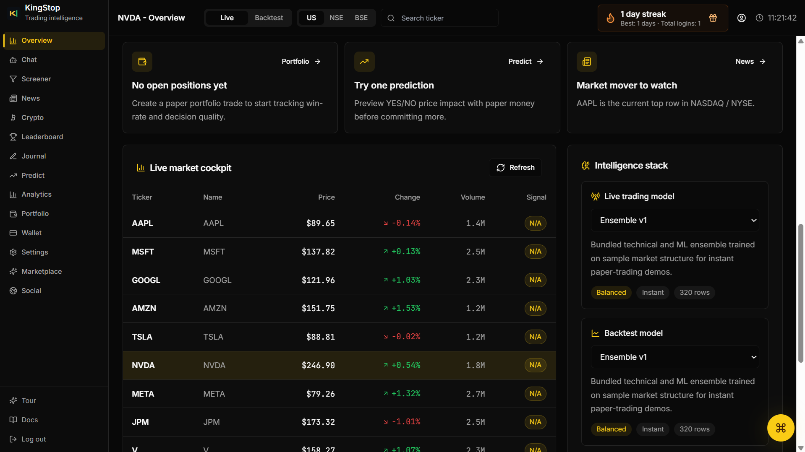

*The dashboard overview — one sign-in away from paper portfolios, signals, and live market views.*

> KingStop is an engineering and educational project. It does not provide
> financial advice or execute real brokerage trades.

## Why KingStop

Trading research is scattered across brokers, charting tools, news tickers,
and spreadsheets — almost nobody gets a single view of the whole loop, let
alone a safe place to rehearse it. KingStop closes the loop on your machine:

- **It runs on your machine.** One `python` + `npm` pair boots the FastAPI
  backend and the React frontend against SQLite and deterministic market
  fixtures. No brokerage, exchange, or API key sits between you and the app.
- **It speaks to real markets.** Yahoo Finance integration streams live data
  for US, NSE, BSE, and crypto tickers when enabled, while the simulated
  collectors keep every feature demoable offline.
- **It shows its work.** Signals explain their indicators, risk manager
  reports position sizing, value-at-risk, and exposure, backtests report
  fills, commission, PnL, and drawdown, and prediction markets resolve with
  auditable CPMM math.
- **It is safe by construction.** Everything happens inside paper portfolios,
  wallets, and watches. Stop-loss and take-profit defaults, position caps,
  and responsible-use guardrails ship on by default.
- **It is social.** Portfolios are visible to the community through
  leaderboards, feeds, streaks, and daily challenges — research you can share
  without handing over your keys.

## Features

| Area | What you get |
|------|--------------|
| Market data | US, NSE, BSE, and crypto price views, historical and real-time workflows, index comparisons, watchlists |
| Signals & screening | Technical + ML signal engines, screeners, news, price targets, prediction-style market intelligence |
| Portfolio & trading | User-owned paper portfolios, wallet, positions, trade plans, trade copy, and backtests |
| Risk | Exposure, correlation matrix, market heatmap, stop-loss / take-profit tools, position and risk caps |
| Prediction markets | CPMM prediction markets with positions, streaks, achievements, and daily challenges |
| Social | Trading journal, social feed, market header dashboard, referrals, alerts, and notifications |
| AI chat | Groq-powered market assistant with an on-board KingStop chat personality |
| Intelligence stack | Fusion engine, trading-models layer, AI explain, and developer reference screens |
| Identity | JWT bearer auth, bcrypt hashing, account preferences, security settings, guided onboarding, keyboard navigation |
| Developer surface | Versioned `/api/v1` FastAPI surface with OpenAPI docs and WebSocket update channels |

## Screenshots

All screenshots are full size in [`assets/screenshots/`](./assets/screenshots/).

### Getting in

| | |
|---|---|
| 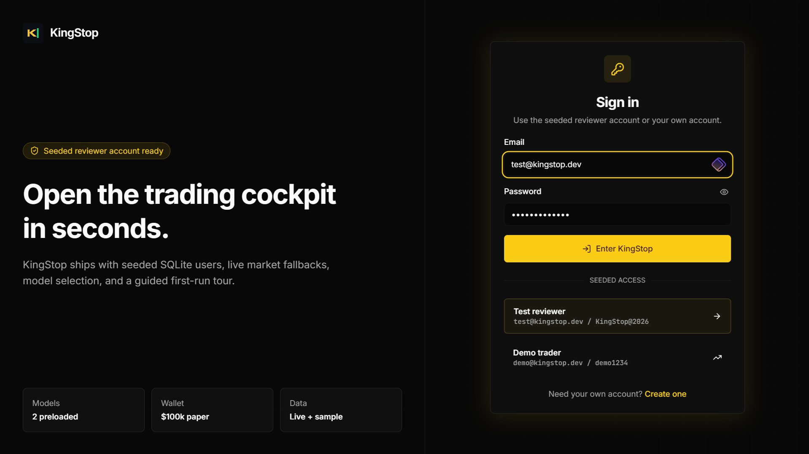 | 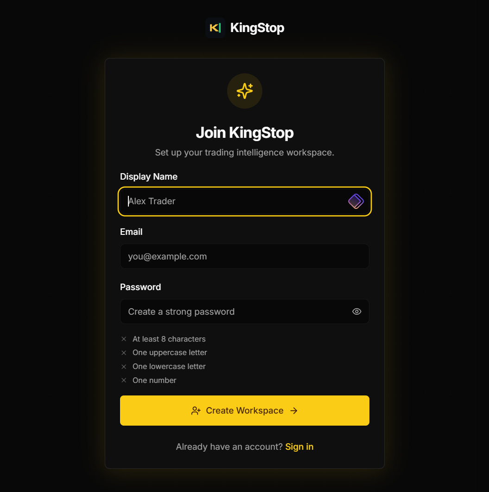 |
| **Login** — JWT-backed sign-in with bcrypt-hashed credentials and protected-route redirect on 401. | **Sign up** — guided onboarding, account preferences, and security settings from the first day. |
| 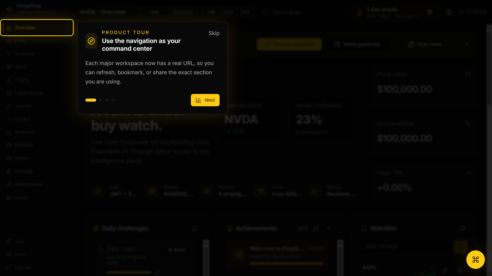 | |
| **Product tour** — the guided walkthrough that gets new users to their first paper trade. | |

### Dashboard & market views

| | |
|---|---|
|  | 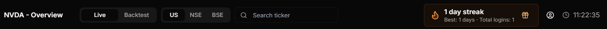 |
| **Dashboard overview** — URL-driven center of the app: portfolios, signals, and activity at a glance. | **Market header** — live US / NSE / BSE / crypto snapshot with index comparison. |
| 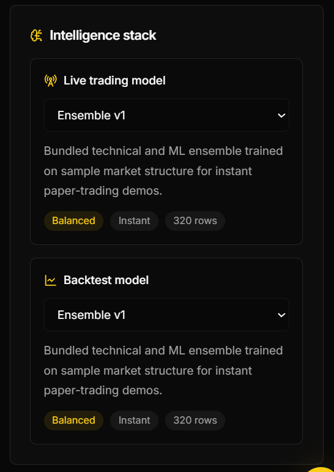 | |
| **Intelligence stack** — the signals, models, and fusion layer visualized together. | |

### Portfolio, trading & risk

| | |
|---|---|
| 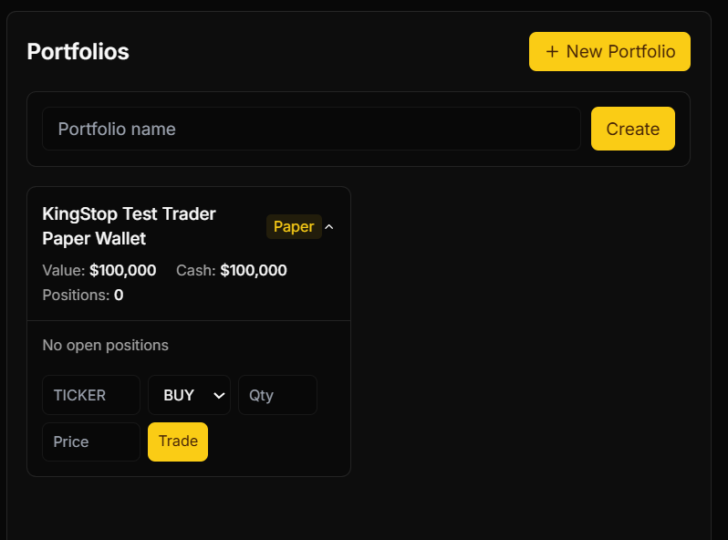 | 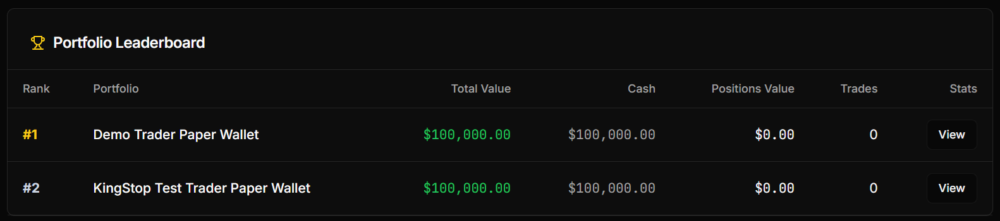 |
| **Portfolios** — user-owned paper portfolios, wallet, positions, and trade plans. | **Leaderboard** — community portfolio standings, streaks, and achievements. |
| 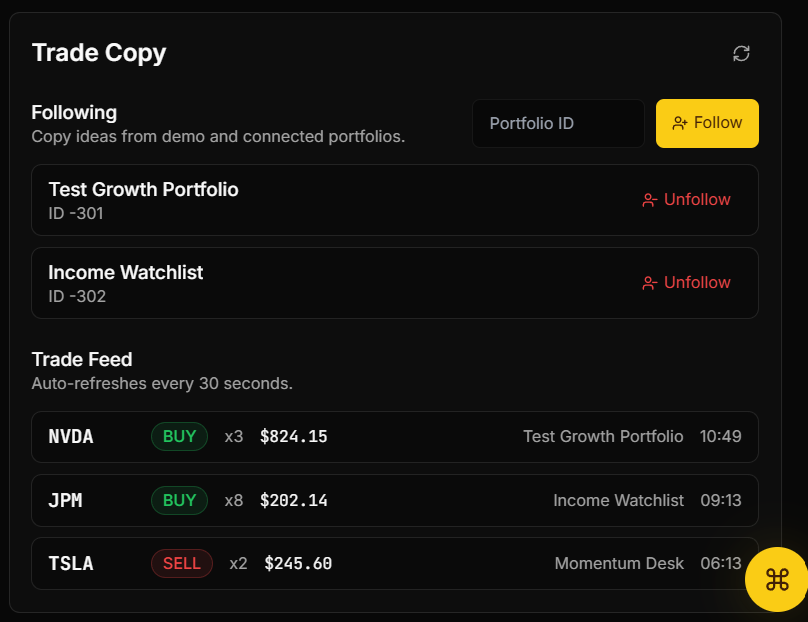 | 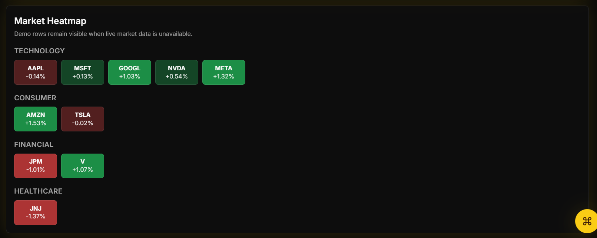 |
| **Trade copy** — rehearse moves and copy trade plans without real money in the loop. | **Market heatmap** — a visual sweep of sector and ticker exposure. |
| 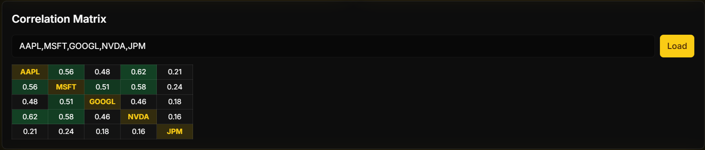 | 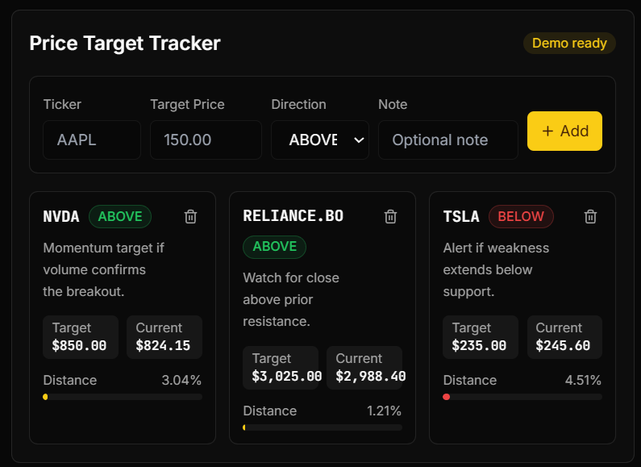 |
| **Correlation matrix** — pairwise asset correlation for smarter diversification. | **Price targets** — analyst-style targets tracked alongside signals. |
| 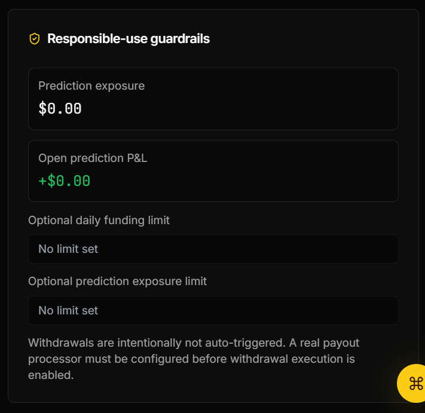 | |
| **Guardrails** — stop-loss / take-profit defaults and position caps, on by default. | |

### Signals, markets & prediction

| | |
|---|---|
| 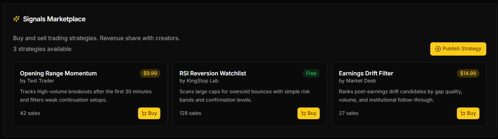 | 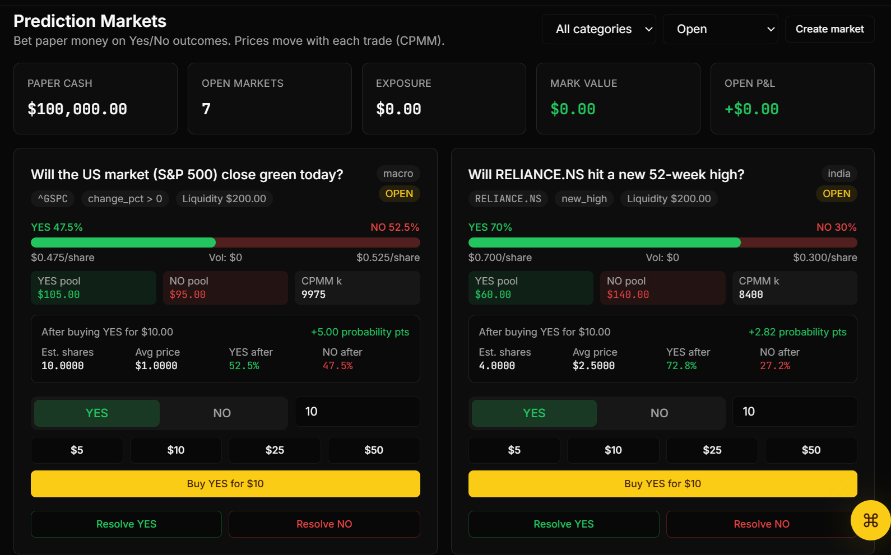 |
| **Signals marketplace** — technical and ML signals browsable like a marketplace. | **Prediction markets** — CPMM prediction markets with auditable resolution. |

### AI chat & community

| | |
|---|---|
| 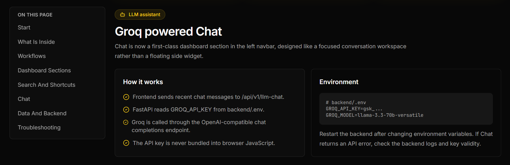 | 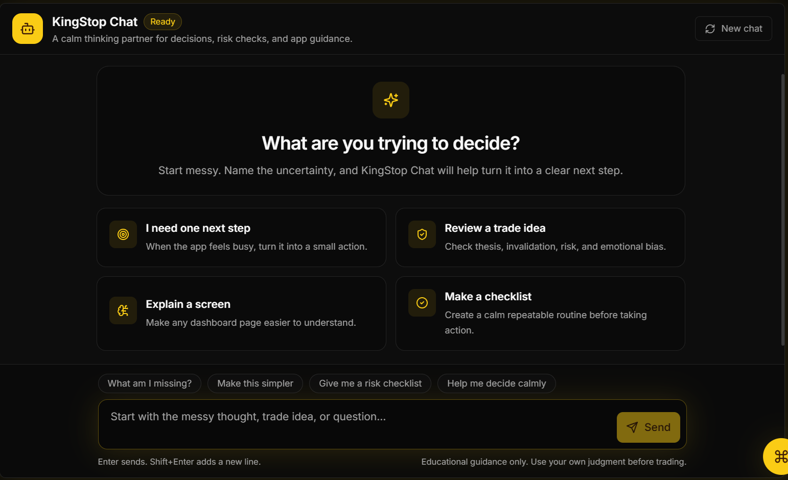 |
| **Groq-powered chat** — fast model responses when `GROQ_API_KEY` is configured. | **KingStop chat** — the in-app market assistant personality. |
| 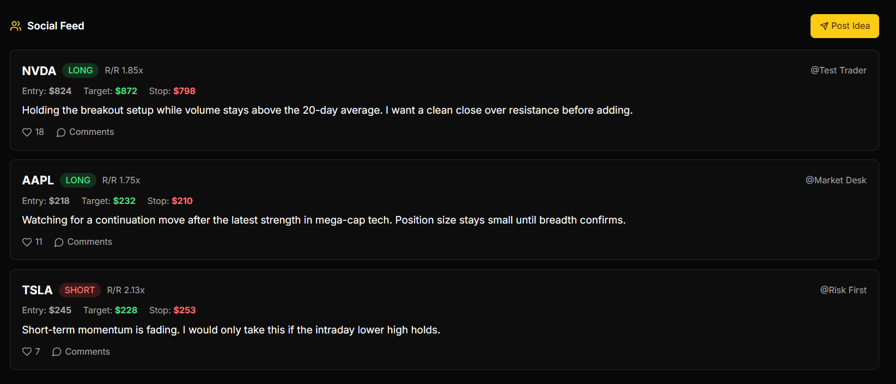 | |
| **Social feed** — trading journal, shared research, and community activity. | |

### Security & developer reference

| | |
|---|---|
| 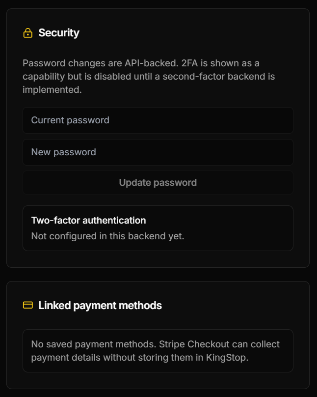 | 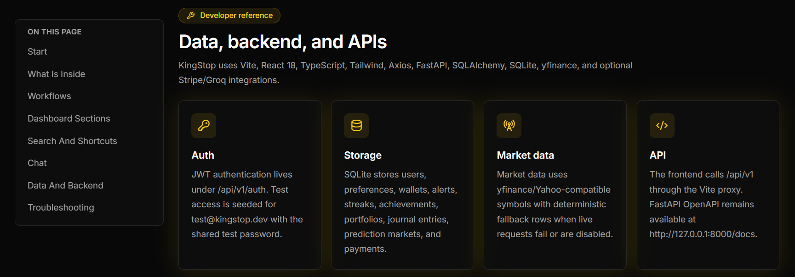 |
| **Security settings** — password, preferences, notifications, privacy, and self-set limits. | **Developer reference** — the API surface for building on KingStop. |

## Documentation

| Document | What it covers |
|----------|----------------|
| [ARCHITECTURE.md](./ARCHITECTURE.md) | Routing, state ownership, backend domain map, and extension guidance |
| [CONTRIBUTING.md](./CONTRIBUTING.md) | Development setup, code style, commit conventions, and the pull request process |
| [ROADMAP.md](./ROADMAP.md) | Proposed future work, planned phases, and where help is most useful |
| [SECURITY.md](./SECURITY.md) | How to report vulnerabilities and security best practices for forks |
| [API docs](http://localhost:8000/docs) | Interactive OpenAPI reference for the `/api/v1` surface (auto-generated by FastAPI) |

## Architecture

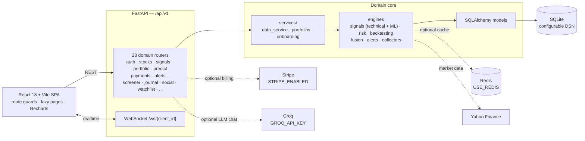

Every optional dependency is **off by default** (`USE_REDIS=false`,
`STRIPE_ENABLED=false`, no `GROQ_API_KEY` set), so a fresh clone runs against
SQLite and deterministic market fixtures with no external services required.

See [ARCHITECTURE.md](ARCHITECTURE.md) for routing, state ownership, and
extension guidance.

## Building & running

### Prerequisites

- Python 3.11+
- Node.js 20+
- npm

### 1. Start the API

```bash
git clone https://github.com/0xMudit/kingswork-trading-intelligence.git
cd kingswork-trading-intelligence/backend
python3 -m venv .venv
source .venv/bin/activate
pip install -r requirements.txt
cp .env.example .env
uvicorn main:app --reload --host 0.0.0.0 --port 8000
```

The API is available at [http://localhost:8000](http://localhost:8000) and its
interactive OpenAPI documentation at
[http://localhost:8000/docs](http://localhost:8000/docs).

### 2. Start the frontend

In a second terminal:

```bash
cd kingswork-trading-intelligence/frontend
npm install
npm run dev
```

Open [http://localhost:5173/kingswork/](http://localhost:5173/kingswork/).
Vite proxies `/api` and `/ws` to the local FastAPI server.

The development database seeds demo users and sample trading data. Override
all demo/test account values in `backend/.env` for any shared deployment.

### Docker

```bash
docker compose up --build
```

This starts the API on port `8000` and the frontend on port `5173`. Review
the compose environment and reverse-proxy settings before production use.

## API domains

The `/api/v1` surface includes authentication, accounts, stocks, signals,
portfolios, alerts, modes, trading models, screeners, news, journals,
analytics, trading tools, social features, prediction markets, marketplace,
price targets, referrals, watchlists, payments, and AI chat. WebSocket routes
provide live update channels at `/ws/{client_id}`.

## Environment configuration

Copy `backend/.env.example` to `backend/.env`. The application works locally
with SQLite and simulated market data; external service keys are optional.

| Group | Important variables |
| --- | --- |
| Core | `DATABASE_URL`, `SECRET_KEY`, `DEBUG`, `API_PREFIX` |
| Market data | `USE_LIVE_MARKET_DATA`, `YAHOO_REFRESH_INTERVAL`, `MARKET_DATA_TIMEOUT_SECONDS` |
| AI chat | `GROQ_API_KEY`, `GROQ_MODEL`, `GROQ_TIMEOUT_SECONDS` |
| Cache | `USE_REDIS`, `REDIS_URL` |
| Billing | `STRIPE_ENABLED`, `STRIPE_SECRET_KEY`, `STRIPE_PUBLISHABLE_KEY`, `STRIPE_WEBHOOK_SECRET` |
| Risk defaults | `MAX_POSITION_SIZE_PCT`, `MAX_PORTFOLIO_RISK_PCT`, `STOP_LOSS_PCT` |

Do not commit `backend/.env`, databases, logs, or production credentials.
These are excluded by `.gitignore`.

## Project structure

```text
backend/
  api/              Versioned domain routers
  auth/             JWT authentication and request dependencies
  collectors/       Market data acquisition
  models/           SQLAlchemy domain models
  services/         Shared business logic
  main.py           FastAPI application and route registration
  config.py         Typed environment configuration
frontend/
  src/components/   Trading and analytics UI
  src/features/     Navigation, onboarding, chat, and feature modules
  src/pages/        Landing, authentication, documentation, dashboard
  src/routes/       Route definitions and guards
  src/services/     API client functions
assets/
  screenshots/      Product screenshots used in this README
```

## Verification

Frontend:

```bash
cd frontend
npm run typecheck
npm test
npm run build
```

Backend tests:

```bash
cd backend
python -m pytest
```

The backend suite covers the risk manager (position sizing, risk scoring, and
value-at-risk) and the backtest engine (fills, commission, PnL, and drawdown).
CI runs both suites, plus the frontend typecheck and build, on every push and
pull request.

## Status

KingStop is a full-stack trading-intelligence and paper-trading platform: the
React 18 + Vite frontend, the FastAPI `/api/v1` surface with 28 domain
routers, the signal/risk/backtest/fusion engines, and the SQLite-first data
layer are all implemented and CI-verified. Optional Yahoo Finance, Redis,
Stripe, and Groq integrations compile behind `USE_*` flags and ship **off by
default**. The live demo is deployed at
https://kingswork-ruddy.vercel.app.

Treated as an engineering and educational project — no real brokerage
execution. Contributions are welcome; see the links below.

## Contributing

Contributions are welcome — issues, docs, and pull requests alike. Start with
[`CONTRIBUTING.md`](CONTRIBUTING.md) for setup and the reviewable-PR bar, and
[`ARCHITECTURE.md`](ARCHITECTURE.md) for where the code lives. Roadmap work is
tracked in [`ROADMAP.md`](ROADMAP.md). Please read the
[Code of Conduct](CODE_OF_CONDUCT.md); it applies to every project space.

## Security

KingStop is a paper-trading and research platform and must not be connected to
a real brokerage. Credentials, Stripe keys, and `GROQ_API_KEY` must remain
environment variables — never commit `backend/.env`, databases, logs, or
production secrets. Report vulnerabilities privately per
[SECURITY.md](SECURITY.md) rather than in a public issue.

## License

[MIT](./LICENSE) — see the LICENSE file for details.